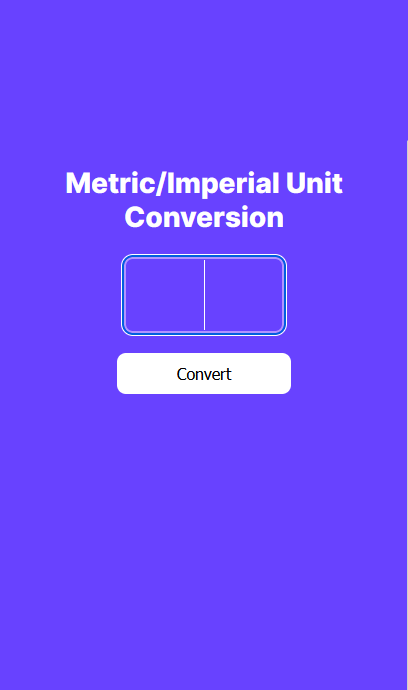
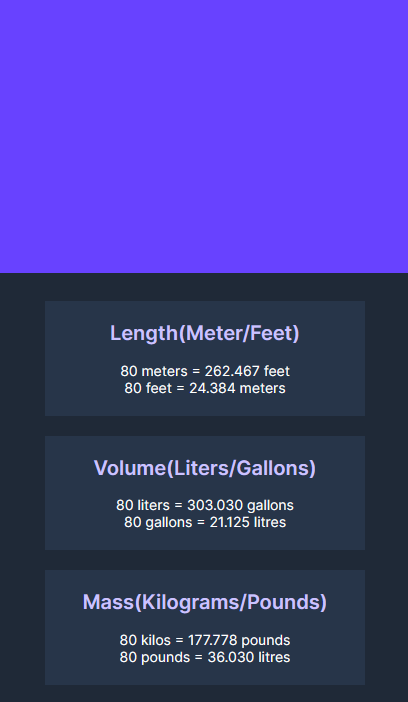

# Unit Converter

## Table of Contents

-   [**Overview**](#overview)
-   [**How to Use**](#how-to-use)
-   [**Folder Structure**](#folder-structure)
-   [**Contributions**](#contributions)

## Overview

This repository hosts the code for a user-friendly unit converter application, crafted with HTML, CSS, and JavaScript. Designed to simplify conversions for mass, length, and volume units, it offers an intuitive interface for users to input numerical values, instantly generating accurate conversions displayed on screen. Ideal for individuals seeking a hassle-free solution for obtaining quick and reliable measurements, it also ensures convenience by preserving conversion history, allowing users to seamlessly resume their tasks even after closing the browser tab or window

## How to use

To utilize the unit converter, navigate to the provided [Live URL](https://heroic-profiterole-f951b8.netlify.app/). Upon arrival, users are greeted with a straightforward interface prompting them to enter numeric values in the designated input area, as depicted below:

After inputting the desired value, simply hit enter to reveal the conversion results, conveniently displayed upon scrolling down, as illustrated:

## Folder Structure

-   index.html: Main markup file and entry point for script-generated HTML code.
-   main.js: Contains logic for unit conversion and rendering conversion output.
-   css: Directory housing CSS files for styling purposes.

## Contributions

Contributions are warmly welcomed. Feel free to fork the repository and submit pull requests, as collaborative efforts are essential for enhancing the functionality and usability of the unit converter. Let's work together to make conversions even more accessible and efficient!
